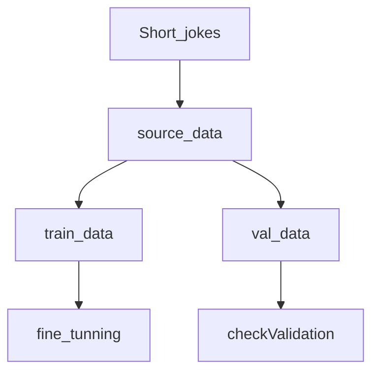

# Fine-tuning GPT2 on Generating Jokes

## Introduction

The main purpose of this code is to clean the jokes data and fine-tune the GPT2LMHEADmodel to generate jokes. In this training, only 5 epochs of the first 20,000 rows of data were trained due to the large size of the data.
Already fine-tuning can donwload from [Quark Cloud](https://pan.quark.cn/s/e372bd9ac146),[Baidu Cloud](https://pan.baidu.com/s/1JZDgPox9cZF-C8ltSN7fwA?pwd=xfvs)

## Getting Started

The raw data is [Short Jokes](https://www.kaggle.com/datasets/abhinavmoudgil95/short-jokes/),this data was obtained by the original author by searching from multiple websites that contain funny short jokes.This data was obtained by the original author by searching from multiple websites that contain funny short jokes.You need to download the dataset before you can use it.

The model used for fine-tuning is the [GPT2LMhead](https://huggingface.co/docs/transformers/v4.47.1/en/model_doc/gpt2#transformers.GPT2LMHeadModel) model of GPT2, which is used because GPT2 has been trained on a large amount of data with good results, and this version has a Head that can be used to output the results.

````python
from transformers import GPT2LMHeadModel, GPT2Tokenizer
````

## Structure

In this model we started by filtering the files and selected the first 20,000 rows as the fine-tuned data due to the fact that too much data would result in too large a training time at one time. Then the data is cleaned to remove non-essential content. Thus, it is used as the data for formal fine-tuning. Before training, the data was also randomly divided into a training set and a validation set, the validation set allows us to verify whether overfitting occurs.



## Use

This training has been carried out within the selection, cleaning, division, setting up DataSet ,Tokenizer, Scheduler, has been trained, validation, storage of the trained model as well as calling and generating the text.

The model has been trained and can be downloaded and imported directly into the fine-tunning model in the code directory to generate text:

````python
model = GPT2LMHeadModel.from_pretrained('./fine_tuned_model').to(device)
tokenizer = GPT2Tokenizer.from_pretrained('./fine_tuned_model')
model.resize_token_embeddings(len(tokenizer))
model.eval()

input_text = "If life gives you melons"
input_ids = tokenizer.encode(input_text, return_tensors='pt').to(device)

# Generate output
output_ids = model.generate(
    input_ids,
    do_sample=True,
    max_length=200,
    num_return_sequences=1,
    temperature=0.2,
    top_p=0.9,
    top_k=50,
    pad_token_id=tokenizer.eos_token_id
)
````

It is also possible to download other datasets to fine-tune your own GPT2 model：

````python
`input_file = './shortjokes.csv'  # source file`
````

## Important Points to Note

**Note:** First time you train your own model, it will take considerable amount of time because of the following reasons -

1. Downloads pre-trained gpt2 model (Depends on your Network Speed)
2. Fine-tunes the gpt2 with your dataset (Depends on size of the data, Epochs, Hyperparameters, etc)


